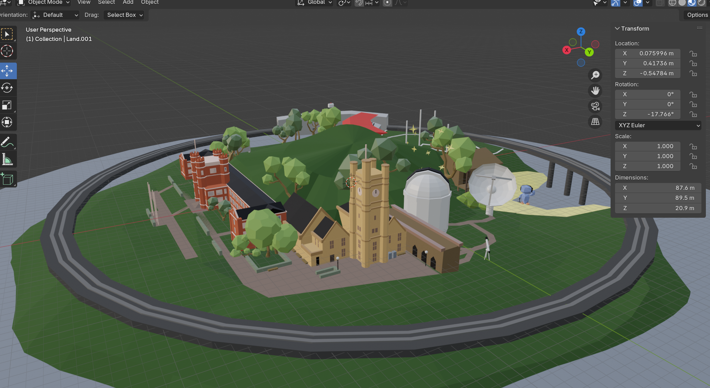

# FreddyTown 🌍 – My Interactive Developer Portfolio

Welcome to **FreddyTown**, my personal developer portfolio turned into a 3D interactive experience. Built with React, Three.js (via React Three Fiber), and Blender assets—all handcrafted by me—this site is a fun, visual showcase of my work, skills, and creative style.

## 🚀 Features

- 🌐 **Full 3D Town**: A stylized, interactive island built using Blender and rendered with Three.js.
- 🎮 **User Interaction**: Click-and-drag to rotate the island, scroll to zoom, and click to explore different buildings representing various stages of my dev journey.
- 💻 **Project Highlights**: Key personal and team-based projects are displayed interactively, including:
  - StarMap – MERN Stack full-stack app
  - You Dropped This, Human – Unity multiplayer game
  - SCprojector – Popular fantasy football Chrome extension

## 🧠 Tech Stack

- **Frontend**: React, Tailwind CSS
- **3D Rendering**: React Three Fiber, Drei, Blender (for 3D modeling)
- **Deployment**: Vercel

## 🎨 Blender Showcase

All 3D assets, including the buildings, landscape, and objects, were modeled by me in Blender.

## 🌀 Island Rotation

FreddyTown supports dynamic 3D interaction:

- Drag with your mouse or finger to rotate the island.
- Scroll to zoom in/out for a closer look at each feature.
- Responsive design works across desktop and mobile.

## 📂 Projects

Each building in FreddyTown represents a major project or milestone. Clicking one reveals more info and GitHub links.

> _Feel free to explore them directly in the code under `src/components/InfoBox.tsx`._

## 📬 Contact

Want to collaborate, chat, or just say hi?

👉 Head to the [Contact page](https://freddytown.vercel.app) or email me directly at **freddy.tnn@gmail.com**.

---

Thanks for visiting FreddyTown—hope you enjoy your stay!
